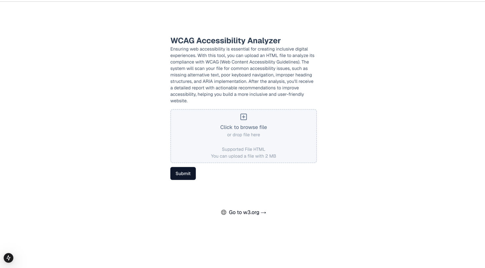
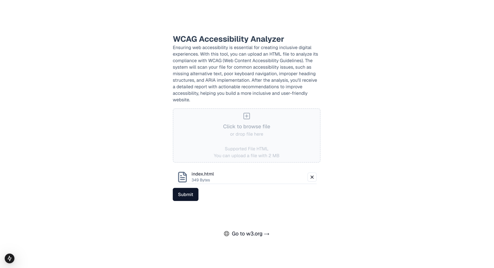
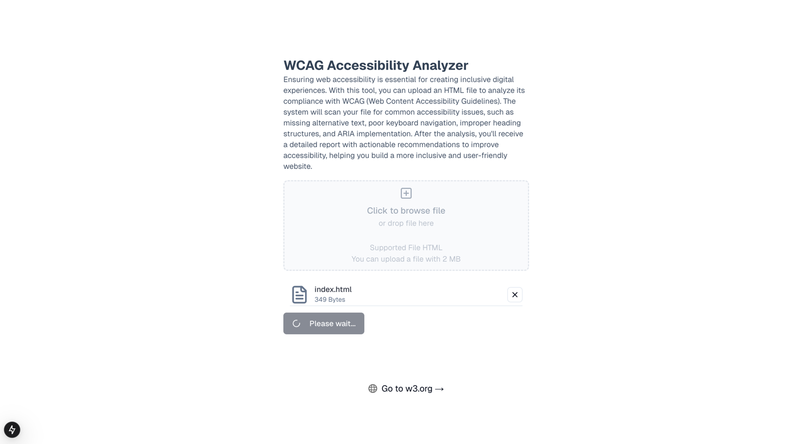
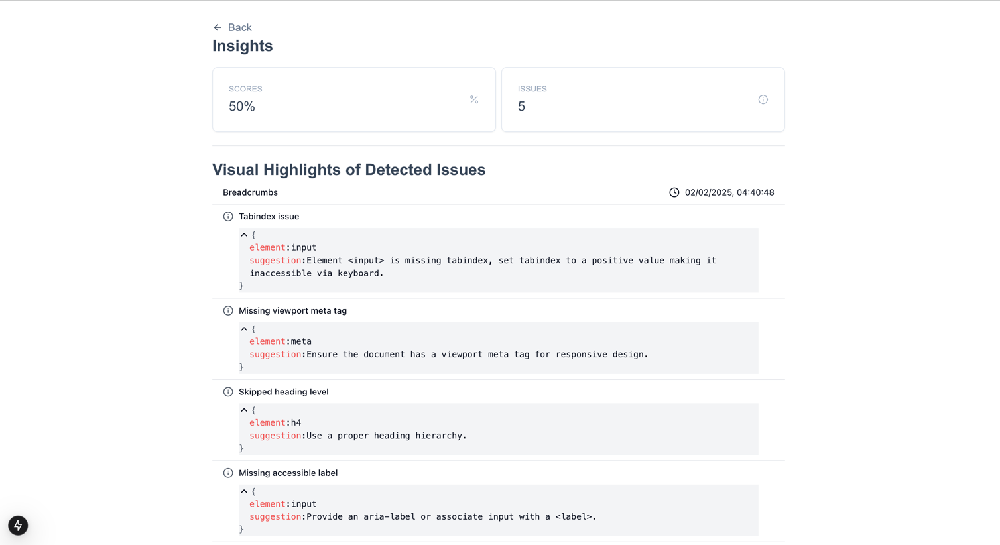

# WCAG Checker

Ensuring web accessibility is essential for creating inclusive
digital experiences. With this tool, you can upload an HTML file
to analyze its compliance with WCAG (Web Content Accessibility
Guidelines). The system will scan your file for common
accessibility issues, such as missing alternative text, poor
keyboard navigation, improper heading structures, and ARIA
implementation. After the analysis, you&#39;ll receive a detailed
report with actionable recommendations to improve accessibility,
helping you build a more inclusive and user-friendly website.

## Prerequisites

Ensure you have the following installed before proceeding:

- [Node.js](https://nodejs.org/) (version 18 or later recommended)
- [npm](https://www.npmjs.com/), [yarn](https://yarnpkg.com/), [pnpm](https://pnpm.io/), or [bun](https://bun.sh/) as a package manager

## Installation

Install dependencies:

```bash

# Install dependencies
npm install  # or yarn install, pnpm install, or bun install
```

## Running the Development Server

To start the development server, run:

```bash
npm run dev  # or yarn dev, pnpm dev, or bun dev
```

Once the server is running, open [http://localhost:3000](http://localhost:3000) in your browser to see the application.

## Environment Variables

These are required environment variables:

```ini
NEXT_PUBLIC_API_URL=http://wcag_checker.test
NEXT_PUBLIC_ENVIRONMENT=
```

## Building and Running in Production

To build and run the application in production mode:

```bash
npm run build  # or yarn build, pnpm build, or bun build
npm start      # or yarn start, pnpm start, or bun start
```

The production build will be optimized and served on [http://localhost:3000](http://localhost:3000).

## Linting and Formatting

Run linting and formatting checks with:

```bash
npm run lint  # Checks for code issues
npm run format  # Formats code according to the defined rules
```

## Deployment

This project can be deployed to platforms like Vercel, Netlify, or Docker.

### Deploy with Docker

To deploy with Docker, build the image and run it:

```bash
docker build -t wcag_checker_fe .
docker run -p 3000:3000 wcag_checker_fe
```

## Screenshots

1. Landing Page
   
2. File Selected
   
3. File Processing
   
4. Analytics Insights page
   

---

### Author

Developed by [Musah Musah](https://github.com/musahmusah).
